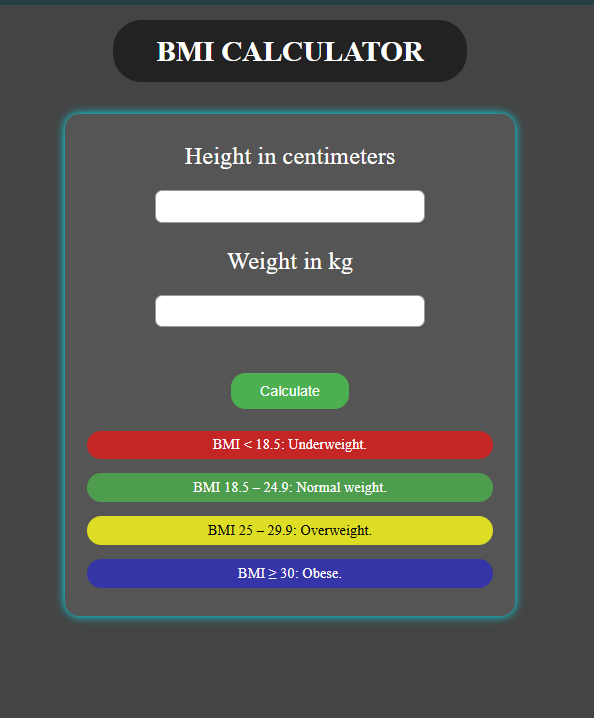

# BMI Calculator

A simple and responsive Body Mass Index (BMI) Calculator built using **HTML**, **CSS**, and **JavaScript**.  
Users can input their height (in cm) and weight (in kg) to calculate their BMI and see which category they fall into.

---

## 📸 Preview

 


---

## 🚀 Live Demo

- (https://dipanshudeep.github.io/BMI_calculater/)


- <p >
  <a href="https://dipanshudeep.github.io/BMI_calculater/" 
     style="text-decoration:none; 
            padding: 10px 20px; 
            border: 1px solid white; 
            color: white; 
            font-weight: bold; 
            border-radius: 8px;">
    Live Demo
  </a>
</p>


---

## ✨ Features

- Calculates BMI based on height and weight  
- Shows color-coded BMI results  
- Displays BMI category:
  - Underweight
  - Normal
  - Overweight
  - Obese
- Fully responsive design  
- Easy to use interface  

---

## 🛠 Technologies Used

- **HTML5**
- **CSS3**
- **JavaScript**

---

## 📏 BMI Formula


JavaScript version:

```javascript
const bmi = (weight / ((height * height) / 10000)).toFixed(2);
